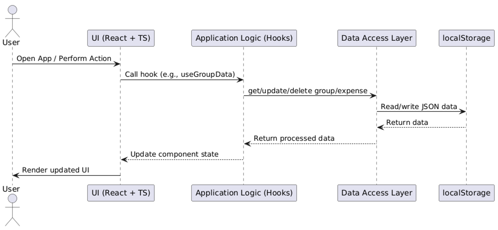
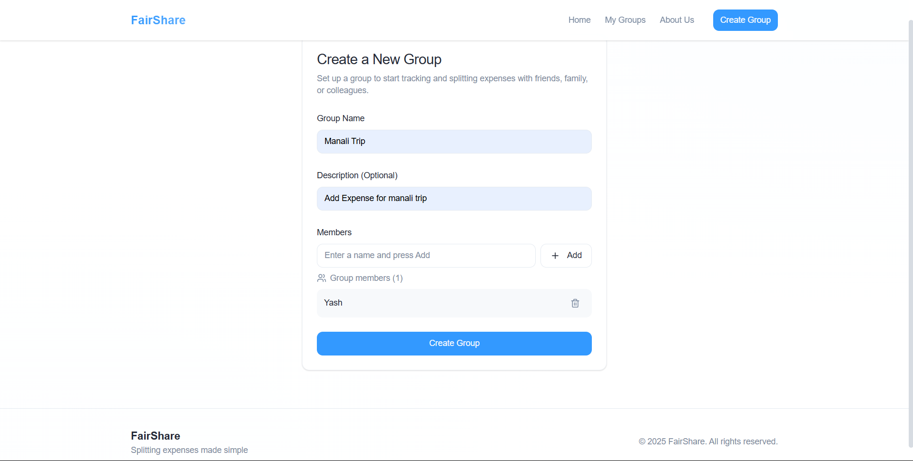
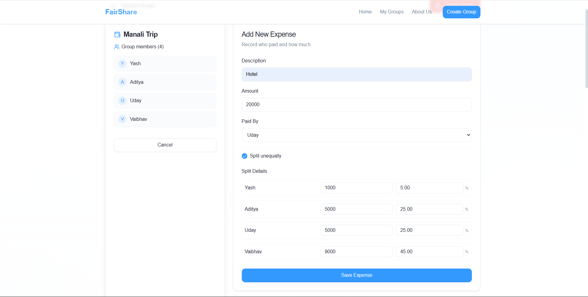
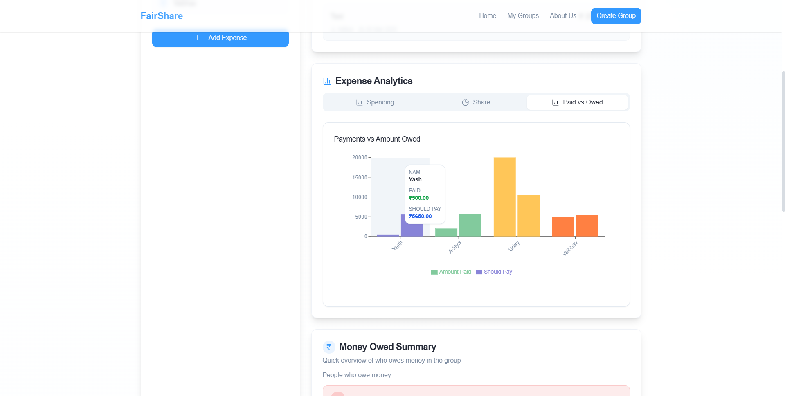
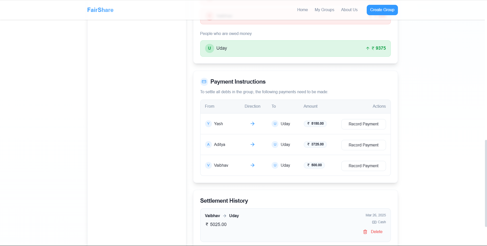

# FairShare

**FairShare** is a fully client-side web application designed to manage and simplify shared group expenses without the need for a dedicated backend server. It enables users to create groups, add members, track expenses, and record settlements seamlessly within their browser. The app leverages localStorage for data persistence, providing full offline functionality with instant performance.

In modern social and professional scenarios—such as trips, hostels, roommates, and team events—managing who owes whom can become complex and error-prone. **FairShare** offers an intuitive interface to keep track of expenses, settlements, and balances.

## Authors

- **Uday Hase**
- **Sahil Nagarkar**
- **Aditya Chorghade**
- **Yash Mali**

## Features

- **Create Groups**: Users can create expense groups and add members.
- **Track Expenses**: Add expenses with descriptions, amounts, dates, and split methods.
- **Instant Updates**: Balances and charts update automatically as expenses are added.
- **Settlement Tracking**: Record settlements with details such as payer, payee, and status.
- **Persistent Data**: Data is stored in the browser using `localStorage` to ensure offline functionality and privacy.
- **React Query Integration**: Ensures that the UI automatically re-renders with the latest state when data changes.

## How to Run

### Step 1: Clone the repository
Clone the repository using the project's Git URL:

```bash
git clone <YOUR_GIT_URL>
```

### Step 2: Navigate to the project directory
Change the working directory to the project folder:

```bash
cd <YOUR_PROJECT_NAME>
```

### Step 3: Install the necessary dependencies
Run the following command to install the required dependencies:

```bash
npm i
```

### Step 4: Start the development server
Start the development server with auto-reloading and an instant preview:

```bash
npm run dev
```

The app will be available at `http://localhost:3000` or a similar local server address.

## Application Flow

### 1) **Users Create Groups and Add Members**
   - Users can create new expense groups and invite members to join the group.

### 2) **Expenses Added with Description, Amount, Date, and Split Method**
   - Users can log expenses by providing descriptions, amounts, dates, and select a method to split the cost (e.g., equally or by custom amounts).

### 3) **Balances and Charts Update Instantly**
   - The app dynamically updates balances for each user and displays charts reflecting the share of each member.

### 4) **Settlements Logged (Amount, Payer/Payee, Status)**
   - Any settlements between members (e.g., who paid what) are logged with details like the amount, payer, payee, and settlement status.

### 5) **Custom Hooks Apply Logic; LocalStorage Persists JSON Data**
   - Custom React hooks are used to handle business logic and persist data in the browser using `localStorage` as JSON.

### 6) **React Query Ensures Re-rendering with Fresh State**
   - React Query ensures the UI automatically re-renders with the latest data and state when any updates occur.

## Sequence Diagram

Here is a high-level sequence diagram illustrating how the users interact with the application:




## UI Preview

Here are some sample UI images demonstrating the interface:

1) **Group Creation and Member Addition**:



2) **Expense Entry Form**:



3) **Balance and Chart Updates**:



4) **Settlement Tracking**:



## Technologies Used

- **React**: For building the user interface.
- **React Query**: For efficient data fetching and state management.
- **localStorage**: For persistent offline data storage.
- **CSS/SCSS**: For styling the application.
- **Chart.js**: For displaying expense distribution in chart format.

## License

This project is licensed under the MIT License - see the [LICENSE](LICENSE) file for details.
